# Flight Phases and Transition Conditions 

## Purpose

This document defines the different phases of flight and how the system transitions between them.

---

## Flight Phases


The Flight Phases are divided into six states, it was structured with the intention of including the most relevant phases during a flight, taking into account the scalability of the project, but at the same time without inducing ambiguity that the use of fewer phases would bring.

| Phase | Description |
| :--- | :--- |
| **PRE-FLIGHT** | System on standby at launch pad. |
| **BOOST** | Motor ignition, ascending with high positive acceleration. |
| **COAST** | Motor burnout, inertial ascent towards the apogee. |
| **APOGEE** | Point of maximum altitude. |
| **DESCENT** | The rocket has passed its apogee and is losing altitude. |
| **RECOVERY** | The rocket has landed and it is safe to approach. |

---

## Transition Conditions

* **PRE-FLIGHT --> BOOST**
    * **Condition:** Vertical acceleration > Minimum threshold for launch confirmation.
    * **Logic:** Detect the initial thrust of the motor

* **BOOST --> COAST**
    * **Condition:** Vertical acceleration < Maximum threshold for burnout confirmation.
    * **Logic:** Detect the burnout of the motor.

* **COAST --> APOGEE**
    * **Condition:** Current altitude < Maximum altitude (hysteresis threshold) confirmed by consecutive readings to confirm apogee.
    * **Logic:** Confirm that the rocket is descending, filtering out possible sampling errors.

* **APOGEE --> DESCENT**
    * **Condition:** Time elapsed in apogee phase > Security Delay.
    * **Logic:** Temporarily ignore sensor readings to allow ejection charge turbulence to stabilize before monitoring descent. (It can be modified according to actions during the flight)

* **DESCENT --> RECOVERY**
    * **Condition:** altitude below a certain height.
    * **Logic:** Detect the impact/touchdown.

---

## Flight Phases Diagram

```mermaid
    stateDiagram-v2
    direction LR

    state "PRE-FLIGHT" as S1
    state "BOOST" as S2
    state "COAST" as S3
    state "APOGEE" as S4
    state "DESCENT" as S5
    state "RECOVERY" as S6

    [*] --> S1
    
    S1 --> S2: <strong>IGNITION DETECTION</strong><br/>(Accel > 20 m/s²)
    
    S2 --> S3: <strong>BURNOUT DETECTION</strong><br/>(Accel < 0 m/s²)
    
    S3 --> S4: <strong>APOGEE CONFIRMATION</strong><br/>(Alt < Max in 5 consecutive readings & Alt < Max - 2 m)
    
    S4 --> S5: <strong>SAFETY DELAY</strong><br/>(Timer > 3.0s)

    S5 --> S6: <strong>TOUCHDOWN</strong><br/>(Alt < 0.5m)
```


---

## Simple State Machine Implemented Using Mock Data

The following Python script was used to initially define and simulate the logic for flight phase transitions. It utilizes a mock dataset to reproduce flight conditions in real-time, allowing for the verification of transition thresholds and system behavior prior to the final C++ implementation.

```Python
import time
from enum import Enum, auto

# --- FLIGHT PHASES ---
class FlightPhase(Enum):
    PRE_FLIGHT = auto()
    BOOST = auto()
    COAST = auto()
    APOGEE = auto()
    DESCENT = auto()
    RECOVERY = auto()

# --- PHYSICAL THRESHOLD ---
LAUNCH_ACCEL_THRESHOLD = 20.0  # m/s^2 (minimum threshold for launch confirmation)
BURNOUT_ACCEL_THRESHOLD = 0.0  # m/s^2 (maximum threshold for burnout confirmation)
APOGEE_ALT_DROP = 2.0          # m (Hysteresis threshold)
MAIN_DEPLOY_ALT = 50.0        # m (parameter to deploy) (during phase)

# SAFEYY COUNTERS AND TIMERS
APOGEE_COUNTER_LIMIT = 5       # Consecutive readings to confirm apogee
APOGEE_SAFETY_DELAY = 3.0      # Waiting time in Apogee phase

class FlightComputer_FSM:
    def __init__(self):
        # INITIAL STATE
        self.phase = FlightPhase.PRE_FLIGHT
        
        # SYSTEM MEMORY
        self.max_altitude = 0.0
        self.apogee_counter = 0      # Hysteresis
        self.state_start_time = 0.0  # Phase time
        
        # ACTION STATE (Actions)
        self.drogue_fired = False
        self.main_fired = False

    # --- PHASE TRANSITION (On Entry) ---
    def transition_to(self, new_phase, current_time):
        print(f"\n[TRANSITION] {self.phase.name} --> {new_phase.name}")
        self.phase = new_phase
        self.state_start_time = current_time

        # Once upon entry actions
        if new_phase == FlightPhase.APOGEE:
            print("   >>> [FIRE DROGUE] (example)")
            self.drogue_fired = True
            
        elif new_phase == FlightPhase.RECOVERY:
            print("   >>> [READY TO RECOVER]")

    # --- DECISION LOGIC ---
    def update(self, accel_z, altitude, current_time):
        # --- ALTITUDE UPDATE ---
        if altitude > self.max_altitude:
            self.max_altitude = altitude
            # apogee counter reset
            self.apogee_counter = 0

        # --- PHASE TRANSITION LOGIC ---
        if self.phase == FlightPhase.PRE_FLIGHT:
            if accel_z > LAUNCH_ACCEL_THRESHOLD:
                self.transition_to(FlightPhase.BOOST, current_time)

        elif self.phase == FlightPhase.BOOST:
            if accel_z < BURNOUT_ACCEL_THRESHOLD:
                self.transition_to(FlightPhase.COAST, current_time)

        elif self.phase == FlightPhase.COAST:
            # Hysteresis
            if altitude < self.max_altitude:
                self.apogee_counter += 1
            else:
                self.apogee_counter = 0 # False apogee
            
            # Apogee transition confirmation
            if self.apogee_counter >= APOGEE_COUNTER_LIMIT and self.apogee_counter < (self.max_altitude - APOGEE_ALT_DROP):
                self.transition_to(FlightPhase.APOGEE, current_time)
                print("   >>> [Apogee: ",self.max_altitude,"m]")

        elif self.phase == FlightPhase.APOGEE:
            # Timer
            time_in_phase = current_time - self.state_start_time
            
            # Safety delay
            if time_in_phase > APOGEE_SAFETY_DELAY:
                self.transition_to(FlightPhase.DESCENT, current_time)

        elif self.phase == FlightPhase.DESCENT:
            # Deploy parachute
            if altitude < MAIN_DEPLOY_ALT and not self.main_fired:
                print(f"   >>> [FIRE MAIN] (Altitude: {altitude}m) (example)")
                self.main_fired = True

            # Recovery condition
            if altitude <= 0.5:
                self.transition_to(FlightPhase.RECOVERY, current_time)

# --- MOCK DATA SIMULATION ---
def run_simulation():
    fsm = FlightComputer_FSM()
    start_time = time.time()
    
    # (Simulated time, Acceleration, Altitude)
    # Format: (Time, Acceleration_Z, Altitude)

    mock_data = [
        (0.0, 9.8, 0.0),
        (0.1, 9.8, 0.0),
        (0.2, 9.8, 0.0),
        (0.3, 9.8, 0.0),
        (0.4, 9.8, 0.0),
        (0.5, 45.0, 0.5),
        (0.6, 50.0, 3.0),
        (0.7, 55.0, 8.0),
        (0.8, 60.0, 18.0),
        (0.9, 60.0, 30.0),
        (1.0, -5.0, 45.0),
        (1.1, -9.8, 55.0),
        (1.2, -9.8, 63.0),
        (1.3, -9.8, 70.0),
        (1.4, -9.8, 75.0),
        (1.5, -9.8, 78.0),
        (1.6, -9.8, 80.0),
        (1.7, -9.8, 79.9),
        (1.8, -9.8, 79.7),
        (1.9, -9.8, 79.4),
        (2.0, -9.8, 78.9),
        (2.1, -9.8, 77.8),
        (2.2, 55.0, 77.5),
        (2.3, -20.0, 77.2),
        (2.4, 5.0, 77.0),
        (2.5, 8.0, 76.8),
        (2.6, 12.0, 76.5),
        (2.7, 9.8, 76.2),
        (2.8, 9.8, 76.0),
        (2.9, 9.8, 75.7),
        (3.0, 9.8, 75.5),
        (3.1, 9.8, 75.2),
        (3.2, 9.8, 75.0),
        (3.3, 9.8, 74.7),
        (3.4, 9.8, 74.5),
        (3.5, 9.8, 74.2),
        (3.6, 9.8, 74.0),
        (3.7, 9.8, 73.7),
        (3.8, 9.8, 73.5),
        (3.9, 9.8, 73.2),
        (4.0, 9.8, 73.0),
        (4.1, 9.8, 72.7),
        (4.2, 9.8, 72.5),
        (4.3, 9.8, 72.2),
        (4.4, 9.8, 72.0),
        (4.5, 9.8, 71.7),
        (4.6, 9.8, 71.5),
        (4.7, 9.8, 71.2),
        (4.8, 9.8, 71.0),
        (4.9, 9.8, 70.7),
        (5.0, 9.8, 70.5),
        (5.1, 9.8, 70.2),
        (5.2, 9.8, 70.0),
        (5.3, 9.8, 68.0),
        (5.4, 9.8, 66.0),
        (5.5, 9.8, 64.0),
        (5.6, 9.8, 62.0),
        (5.7, 9.8, 60.0),
        (5.8, 9.8, 58.0),
        (5.9, 9.8, 56.0),
        (6.0, 9.8, 54.0),
        (6.1, 9.8, 52.0),
        (6.2, 9.8, 49.9),
        (6.3, 9.8, 45.0),
        (6.4, 9.8, 40.0),
        (6.5, 9.8, 35.0),
        (6.6, 9.8, 30.0),
        (6.7, 9.8, 25.0),
        (6.8, 9.8, 20.0),
        (6.9, 9.8, 15.0),
        (7.0, 9.8, 10.0),
        (7.1, 9.8, 5.0),
        (7.2, 9.8, 2.0),
        (7.3, 9.8, 1.0),
        (7.4, 9.8, 0.5),
        (7.5, 9.8, 0.0)
    ]

    print("--- FLIGHT SIMULATION STARTING ---")
    for t, acc, alt in mock_data:
        # Real-Time simulation
        print(t, acc, alt)
        fsm.update(acc, alt, t)
        time.sleep(0.1)
```
---
