# Flight Phases and Transition Conditions 

## Purpose

This document defines the different phases of flight and how the system transitions between them.

---

## Flight Phases


The Flight Phases are divided into six states, it was structured with the intention of including the most relevant phases during a flight, taking into account the scalability of the project, but at the same time without inducing ambiguity that the use of fewer phases would bring.

| Phase | Description |
| :--- | :--- |
| **PRE-FLIGHT** | System on standby at launch pad. |
| **BOOST** | Motor ignition, ascending with high positive acceleration. |
| **COAST** | Motor burnout, inertial ascent towards the apogee. |
| **APOGEE** | Point of maximum altitude. |
| **DESCENT** | The rocket has passed its apogee and is losing altitude. |
| **RECOVERY** | The rocket has landed and it is safe to approach. |

---

## Transition Conditions

* **PRE-FLIGHT --> BOOST**
   * **Logic:** Detect the initial thrust of the motor.
   * **Condition:** Vertical acceleration > 30.0 m/s² (~3G) (Minimum acceleration threshold) & Altitude > 30.0 m (Minimum altitude threshold).
   * **Value Justification:** 30.0 m/s² is standard to reject handling bumps but detect all HPR motors, 30.0 m is generally used in barometric logic and in this case functions as a safety condition for phase change.
* **BOOST --> COAST**
   * **Logic:** Detect the burnout of the motor.
   * **Condition:** Vertical acceleration < -2.0 m/s² (Maximum acceleration threshold).
   * **Value Justification:** After motor burnout, drag causes immediate deceleration, -2.0 m/s² ensures the rocket is physically slowing down.

* **COAST --> APOGEE**
   * **Logic:** Confirm that the rocket is descending, filtering out possible sampling errors.
   * **Condition:** Current altitude < Maximum altitude (hysteresis threshold) confirmed by 10 consecutive readings to confirm apogee & Current altitude < Max altitude - 5.0 m.
   * **Value Justification:** 10 samples robustly filters out noise, 5.0 m provides a solid confirmation that the rocket has tipped over and is descending.

* **APOGEE --> DESCENT**
   * **Logic:** Temporarily ignore sensor readings to allow ejection charge turbulence to stabilize before monitoring descent. (It can be modified according to actions during the flight)
   * **Condition:** Time elapsed in apogee phase > 2.0 s (Security Delay).
   * **Value Justification:** 2.0 s delay allows the airframe dynamics to stabilize.

* **DESCENT --> RECOVERY** 
   * **Logic:** Detect the impact/touchdown. 
   * **Condition:** Altitude < 50.0 m & Altitude change < 2.0 m over 10.0 s 
   * **Value Justification:** 10.0 s acts as a safety buffer against false landing detection caused by barometric drift, ground-level turbulence, or temporary pressure anomalies.

---

## Flight Phases Diagram

```mermaid
    stateDiagram-v2
    direction LR

    state "PRE-FLIGHT" as S1
    state "BOOST" as S2
    state "COAST" as S3
    state "APOGEE" as S4
    state "DESCENT" as S5
    state "RECOVERY" as S6

    [*] --> S1
    
    S1 --> S2: <strong>IGNITION DETECTION</strong><br/>(Accel > 30.0 m/s² (~3G) & alt > 30.0 m)
    
    S2 --> S3: <strong>BURNOUT DETECTION</strong><br/>(Accel < -2.0 m/s²)
    
    S3 --> S4: <strong>APOGEE CONFIRMATION</strong><br/>(Alt < Max in 10 consecutive readings & Alt < Max - 5 m)
    
    S4 --> S5: <strong>SAFETY DELAY</strong><br/>(Timer > 2.0 s)

    S5 --> S6: <strong>TOUCHDOWN</strong><br/>(Alt < 50.0 m & Alt change < 2.0 m over 10.0 s)
```


---

## Simple State Machine Implemented Using Mock Data

The following Python script was used to initially define and simulate the logic for flight phase transitions. It utilizes a mock dataset to reproduce flight conditions in real-time, allowing for the verification of transition thresholds and system behavior prior to the final C++ implementation.

```Python
import time
from enum import Enum, auto

# --- FLIGHT PHASES ---
class FlightPhase(Enum):
    PRE_FLIGHT = auto()
    BOOST = auto()
    COAST = auto()
    APOGEE = auto()
    DESCENT = auto()
    RECOVERY = auto()

# --- PHYSICAL THRESHOLD ---
LAUNCH_ALT_THRESHOLD = 30.0     # m (minimum altitude for launch confirmation)
LAUNCH_ACCEL_THRESHOLD = 30.0   # m/s^2 (minimum threshold for launch confirmation)
BURNOUT_ACCEL_THRESHOLD = -2.0  # m/s^2 (maximum threshold for burnout confirmation)
APOGEE_ALT_DROP = 5.0           # m (Hysteresis threshold)
MAIN_DEPLOY_ALT = 200.0         # m (parameter to deploy) (during phase)
LANDING_ARM_ALT = 50.0          # m (below this altitude is possible the recover)
LANDING_STABILITY = 2.0         # m (range of movement to consider recover)
LANDING_TIME_THRESHOLD = 10.0   # s (waiting time to confirm recover)

# SAFETY COUNTERS AND TIMERS
APOGEE_COUNTER_LIMIT = 10       # Consecutive readings to confirm apogee
APOGEE_SAFETY_DELAY = 2.0       # Waiting time in Apogee phase

class FlightComputer_FSM:
    def __init__(self):
        # INITIAL STATE
        self.phase = FlightPhase.PRE_FLIGHT
        
        # SYSTEM MEMORY
        self.max_altitude = 0.0
        self.apogee_counter = 0         # Hysteresis
        self.state_start_time = 0.0     # Phase time
        self.last_alt_reading = 0.0     # Reference to detect movement
        self.landing_start_time = None  # Initial time of the timestamp
        
        # ACTION STATE (Actions)
        self.drogue_fired = False
        self.main_fired = False

    # --- PHASE TRANSITION (On Entry) ---
    def transition_to(self, new_phase, current_time):
        print(f"\n[TRANSITION] {self.phase.name} --> {new_phase.name}")
        self.phase = new_phase
        self.state_start_time = current_time

        # Once upon entry actions
        if new_phase == FlightPhase.APOGEE:
            print("   >>> [FIRE DROGUE] (example)")
            self.drogue_fired = True
            
        elif new_phase == FlightPhase.RECOVERY:
            print("   >>> [READY TO RECOVER]")

    # --- DECISION LOGIC ---
    def update(self, accel_z, altitude, current_time):
        # --- ALTITUDE UPDATE ---
        if altitude > self.max_altitude:
            self.max_altitude = altitude
            # apogee counter reset
            self.apogee_counter = 0

        # --- PHASE TRANSITION LOGIC ---

        # -- Pre-flight --
        if self.phase == FlightPhase.PRE_FLIGHT:
            if accel_z > LAUNCH_ACCEL_THRESHOLD and altitude > LAUNCH_ALT_THRESHOLD:
                self.transition_to(FlightPhase.BOOST, current_time)

        # -- Boost --
        elif self.phase == FlightPhase.BOOST:
            if accel_z < BURNOUT_ACCEL_THRESHOLD:
                self.transition_to(FlightPhase.COAST, current_time)

        # -- Coast --
        elif self.phase == FlightPhase.COAST:
            # Hysteresis
            if altitude <= self.max_altitude:
                self.apogee_counter += 1
            else:
                self.apogee_counter = 0 # False apogee
            
            # Apogee transition confirmation
            if self.apogee_counter >= APOGEE_COUNTER_LIMIT and altitude < (self.max_altitude - APOGEE_ALT_DROP):
                self.transition_to(FlightPhase.APOGEE, current_time)
                print("   >>> [Apogee: ",self.max_altitude,"m]")

        # -- Apogee --
        elif self.phase == FlightPhase.APOGEE:
            # Timer
            time_in_phase = current_time - self.state_start_time
            
            # Safety delay
            if time_in_phase > APOGEE_SAFETY_DELAY:
                self.transition_to(FlightPhase.DESCENT, current_time)

        # -- Descent --
        elif self.phase == FlightPhase.DESCENT:
            # Deploy parachute
            if altitude < MAIN_DEPLOY_ALT and not self.main_fired:
                print(f"   >>> [FIRE MAIN] (Altitude: {altitude}m) (example)")
                self.main_fired = True

            # Recovery conditions
            if altitude < LANDING_ARM_ALT:
                is_stationary = abs(altitude - self.last_alt_reading) < LANDING_STABILITY

                # Timestamp
                if is_stationary:
                    if self.landing_start_time is None:
                        self.landing_start_time = current_time  
                    
                    elapsed_time = current_time - self.landing_start_time
                    
                    if elapsed_time >= 10.0:
                        self.transition_to(FlightPhase.RECOVERY, current_time)
                        
                else:
                    self.landing_start_time = None
            
            self.last_alt_reading = altitude

# --- MOCK DATA SIMULATION ---
def run_simulation():
    fsm = FlightComputer_FSM()
    start_time = time.time()
    
    # (Simulated time, Acceleration, Altitude)
    # Format: (Time, Acceleration_Z, Altitude)

    mock_data = [
        (0.0, 9.8, 0.0),
        (0.1, 9.7, 0.1),
        (0.5, 45.0, 0.2), 
        (0.6, 9.8, 0.2),
        (0.8, 9.8, 25.0), 
        (0.9, 9.8, 0.0),
        (1.0, 50.0, 5.0),  
        (1.1, 55.0, 15.0), 
        (1.2, 60.0, 22.0),
        (1.5, 60.0, 100.0),
        (2.0, 40.0, 200.0),
        (2.5, -5.0, 300.0),
        (3.0, -9.8, 350.0),
        (5.0, -9.8, 450.0),
        (5.1, -9.8, 448.0),
        (5.2, -9.8, 446.0),
        (5.3, -9.8, 444.0),
        (5.4, -9.8, 455.0),
        (10.0, -9.8, 500.0),
        (10.1, -9.8, 500.0),
        (10.2, -9.8, 499.5),
        (10.3, -9.8, 499.0),
        (10.4, -9.8, 498.5),
        (10.5, -9.8, 498.0),
        (10.6, -9.8, 497.5),
        (10.7, -9.8, 497.0),
        (10.8, -9.8, 496.0),
        (10.9, -9.8, 495.0),
        (11.0, -9.8, 494.0),
        (11.1, -9.8, 493.0),
        (11.5, -9.8, 490.0),
        (12.5, -9.8, 480.0), 
        (13.2, -9.8, 470.0),
        (15.0, 0.0, 400.0),
        (20.0, 0.0, 300.0),
        (25.0, 0.0, 205.0),
        (25.1, 0.0, 199.0),
        (40.0, 0.0, 60.0),
        (42.0, 0.0, 40.0),
        (43.0, 0.0, 10.0),
        (44.0, 0.0, 0.5),
        (45.0, 0.0, 0.5),
        (46.0, 0.0, 0.5),
        (47.0, 0.0, 0.5),
        (48.0, 0.0, 3.5),
        (49.0, 0.0, 0.5),
        (50.0, 0.0, 0.5),
        (52.0, 0.0, 0.5),
        (54.0, 0.0, 0.5),
        (56.0, 0.0, 0.5),
        (58.0, 0.0, 0.5),
        (59.5, 0.0, 0.5),
        (60.0, 0.0, 0.5)
    ]

    print("--- FLIGHT SIMULATION STARTING ---")
    for t, acc, alt in mock_data:
        # Real-Time simulation
        print(t, acc, alt)
        fsm.update(acc, alt, t)
        time.sleep(0.1)

if __name__ == "__main__":
    run_simulation()
```
---
