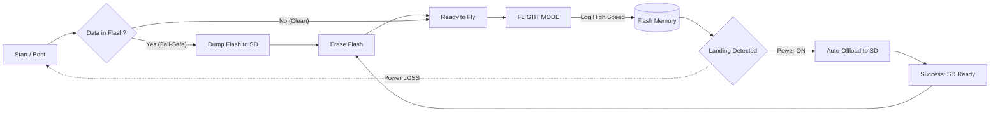

# Logging Framework

## Purpose

Define the telemetry storage strategy, ensuring data integrity under high-dynamic flight conditions through serialization protocols and fail-safe hardware utilization.

---

## Storage Architecture

The system implements a Deferred Storage Architecture. Flight telemetry is logged exclusively to the on-board Flash module during flight, with an automatic offload to the SD card immediately upon landing detection or system reboot.

### Justification

* **Mechanical immunity:** The soldered-down Flash module is immune to the high-frequency vibrations and G-forces that typically cause momentary contact failures in mechanical SD card slots.
    
* **Deterministic timing:** Flash module provides predictable write latencies, eliminating the blocking delays inherent to SD card modules.

* **Data recovery:** Upon landing detection, the system flushes the buffer to the SD card. If power is lost upon impact, the Boot Fail-Safe detects pending data on the next power-up and forces a dump before the system can be armed again.

### Architecture Diagram 

---

## Data Serialization & Format

To ensure high-performance logging without compromising CPU cycles, the system avoids text conversion (CSV) during flight. Instead, it implements a Direct Binary Serialization protocol.

### Storage Format

Data is stored in .bin files by directly dumping the memory block of the `StructGlobalData` structure into the storage media.

### Data Structure

The log follows a nested structure architecture defined by the `StructGlobalData` container. This ensures strict separation between raw sensor inputs and algorithmic outputs within the same synchronized frame.

(Note: Full structure definition provided in [constants.h](../../ELS-02/include/constants.h))

### Multi-Rate Synchronization

Since sensors operate at different frequencies, the system uses a "snapshot" strategy enabled by the individual timestamps inside each sub-structure.

* **Global Timestamp:** The system records a full `StructGlobalData` snapshot at the target loop rate.

* **Data Freshness Logic:** 

    * **Fast Sensors:** Update every cycle. Their local timestamp matches the Global Timestamp.

    * **Slow Sensors:** Update only when new data is ready. If data is not ready, the previous value and previous timestamp are retained.

*Analysis Note:* During post-flight analysis, duplicate timestamps in specific sub-structures effectively flag "held" data, allowing the analysis software to reconstruct the exact timeline without interpolation errors.

---
