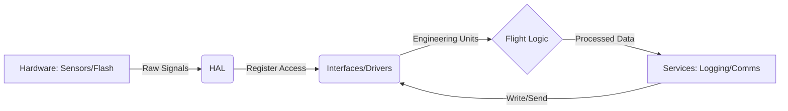

# Overall Firmware Architecture and Layer Responsabiblities

## Purpose

This document defines how the firmware is structured at a high level. This includes what each layer (HAL, interfaces, logic) is allowed to do, and what it must not do.

---

## Block Diagram

---

## Layer Responsabilities

* **HAL (Hardware Abstraction Layer):** Abstract the specific hardware of the microcontroller. Manage buses (I2C, SPI), GPIOs, timers, interrupts and low-level data buffering.

* **Interfaces/Drivers:** Translate the HAL data into physical units. "Label" the data so that the logic can understand it without hardware-specific knowledge.

* **Flight Logic:** Estimate state (speed/position), detect flight phases and calculate structural metrics.

* **Services:** It provides cross-functional utilities such as the DataLogger. It handles the structured persistence of data on the SD card.

---

## Forbidden Dependencies

* **HAL (Hardware Abstraction Layer):** It must not be aware of the existence of specific sensors, file services, or flight algorithms, nor contain mission state variables.

* **Interfaces/Drivers:** It must not include Flight Logic or mission awareness, it is not its responsibility to know what phase of flight it is in.

* **Flight Logic:** It must not depend on or be aware of hardware-specific details, and must not access peripherals or low-level interfaces directly.

* **Services:** The DataLogger service must be generic, it is not responsible for knowing what data it is saving, it should only transmit or only store the message that the Flight Logic tells it to.
