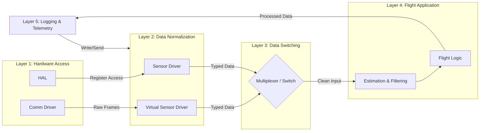

# Overall Firmware Architecture and Layer Responsabiblities

## Purpose

This document defines the high-level structure of the firmware for the flight instrumentation system. It establishes responsabilities and limitations for each layer to ensure modularity.

---

## Block Diagram

The software firmware is divided into five layers, it was structured to operate with real sensor data or sensor-like data injected through the serial interface (flight logic is not aware of whether data is real or injected)

---

## Layer Responsabilities

* **Hardware Access:**
    * Configure and control communication buses (I2C, SPI, UART).
    * Perform the exchange of bytes or electrical signals without interpreting their physical meaning.
    * Expose a generic interface so that the upper layers do not depend on a specific MCU model.

* **Data Normalization:**
    * Convert binary records or parsers into physical variables.
    * Ensure that both the physical and virtual drivers deliver the same data structure format (Typed Data).
    * Process external serial frames to simulate the behavior of a real sensor.

* **Data Switching:**
    * Dynamically switch between real or injected sensor data depending on the operating mode.
    * Deliver a single, constant flow (Clean Input) to the application, hiding the origin of the data.

* **Flight Application:**
    * Estimate state (speed, position, etc).
    * Detect flight phases.
    * Calculate structural metrics.
    * Apply filters (such as Kalman) to smooth and correct the input data.

* **Logging & Telemetry:**
    * Write the states and telemetry to local media (SD or Flash cards).
    * Record the complete flow (Processed Data) to allow for post-flight analysis or fault debugging.

---

## Forbidden Dependencies

* **Hardware Accesss:**
    * Processing or interpreting the meaning of the data is prohibited; it must only transfer byte streams or raw signals between the hardware and the upper layers.
    * Mission knowledge is restricted; it cannot make decisions based on the flight state.
    * Defining complex data structures is prohibited; it must operate only with generic buffers without distinguishing types.
   
* **Data Normalization:**
    * Dependency between the Sensor Driver and the Virtual Sensor Driver is prohibited; they must be completely isolated modules.
    * Source selection is restricted; it cannot decide on its own whether to deliver real or virtual data to the system.
    * It is mandatory to guarantee exact conversion to primitive types (bool, int16, float32) before transferring the information to the next layer.
 
* **Data Switching:**
    * Calculations, filters, or modifications to input values ​​are prohibited.
    * Upstream access is restricted; it cannot execute flight logic functions.
    * History storage is prohibited; it must function as a bridge for passing instantaneous data without memory of previous states.

* **Flight Application:**
    * Direct access to Layer 1 hardware or communication drivers is prohibited.
    * Source differentiation is restricted; it must operate identically regardless of whether the data is real or injected.
    * Managing physical writes to memory or transmitting telemetry signals is prohibited.

* **Logging & Telemetry:**
    * It is prohibited to rely on the application's internal logic; it must receive data in serializable formats with explicit memory sizes.
    * Control over the vehicle is restricted; it has no authority to change flight states or send control commands.
    * It is prohibited to implement low-level protocols; it must delegate physical transmission to the lower-layer communication infrastructure.

